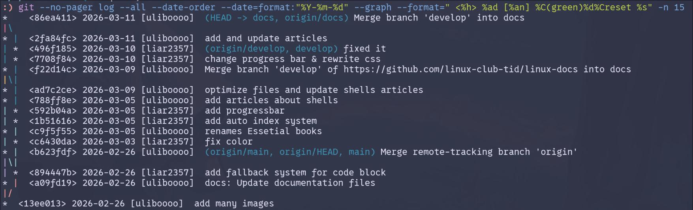
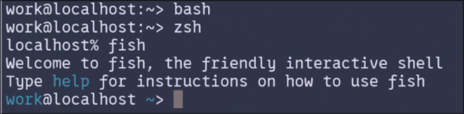

この記事ではShellについての概観を知ることが出来ます。

## 関連

- Shell scriptに関しては

## Shellは中間管理職

Shellとはkerenlに指示を行うための中間翻訳者のようなツールです。ファイルを作るときにc言語などでシステムコールを行うのは非現実的です。そこでそのような操作を支援するコマンドとそれらを呼び出すためのソフトウェアとしてShellがあります。

Shellが行う操作は主にコマンドの**検索と実行, それらの入出力**です。またShell固有の機能があることも多いです。ユーザーとKernelとの中間管理を行ってくれます。

### コマンドを探す

通常、コマンドを実行するにはそのコマンドのプログラムファイル(実行ファイル)のファイルパスを指定する必要があります。しかしファイルのリストを表示するためだけに`/usr/bin/ls`なんて打っていられません。そこで事前に実行ファイルのあるフォルダをShellに知らせておくことでShellはそのコマンドのパスをファイル名まで省略して解釈できます。
そしてそのパスたちは`$PATH`という変数に保持されており、デフォルトでは`/usr/bin`や`/bin`を持ちます。`apt install`などで新規インストールしたプログラムもコマンド名だけで実行出来るのは上記のような場所に実行ファイルが設置されるためです。しかし一部のソフトウェアなどは標準外に設置されるため、各ShellでPATHに追加のパスを設定する必要があります。

以下のような設定を`~/.bashrc`とか`~/.zshrc`に追記することでShellが検索する場所を追加できます。追加するパスは実行ファイルそのものではなくその実行ファイルの存在するフォルダである必要があります。また、最初に見つかったコマンドが優先されるので"追加するパス:$PATH"とした場合は追加パスが優先されます。
```bash
# "xxx:$PATH"は追加したほうが優先される
PATH="$HOME/my-apps/bin:$PATH"

# こっちなら逆
PATH="$PATH:$HOME/my-apps/bin"
```

### コマンドを実行して繋ぐ

各コマンドは入出力持っており、それらの画面管理等々を行います。またパイプラインという機能もあり(kernelを経由してる)コマンドの出力を次のコマンドに流し込むことができます。より細かい話についてはcommandsを参照してください。

### Aliasとかの付随機能

より詳しい話は[ここ](### 機能性は正義か?)にて。Shellには上記の機能以外にもaliasと呼ばれるコマンドの置換機能のようなものがついていることが殆どです。

例えば`git`においてログをきれいに出力するオプションがあるのですがそれがとても長いのです。`git --no-pager log --all --date-order --date=format:"%Y-%m-%d" --graph --format=" <%h> %ad [%an] %C(green)%d%Creset %s" -n 15`これを実行すると以下のようにgit logをグラフィカルに表示できます。



しかしこんなコマンドを何度も手打ちするのは非現実的なのでShellに対して`gls`と言ったら`git --no-pager log --all --date-order --date=format:"%Y-%m-%d" --graph --format=" <%h> %ad [%an] %C(green)%d%Creset %s" -n 15`を実行して、と命令を先に設定で書いておきます。そうすることでユーザーは長いコマンドや定型的なコマンドをに別名(=Alias)を付けて実行が出来ます。

また、"機能性は正義か?"でも解説しますがファイルパスの補完などの機能も基本的にはShellの機能として提供されているため、選んだShellごとに機能性や設定の仕方が変わります。

bashやzshに関しては`alias name='commands'`というフォーマットで`~/.bashrc`などの設定ファイルに記述されることがほとんどです。

## 有名なShells

Shellにはいくつかの種類があり、上記のような必須な機能に対して追加の機能ももったものがリリースされています。以下に代表例を上げますが、`Bash`がおそらく最も多くもディストリビューションにデフォルトで採用されているShellです。

- bash
    - GPLライセンス
    - Linuxのスタンダード
    - 圧倒的安定性と安心感
- zsh
    - MITライセンス
    - macOSのスタンダード
    - Bash互換を保ちながらもより強力なglob(ワイルドカード)などのモダン構成
- fish
    - MITライセンス
    - 第二言語的な立ち位置
    - インストール時点でサブコマンド補完やシンタックスハイライトが揃う圧倒的な機能性
- nushell
    - written by Rust
    - 出力をテーブルデータとして扱う
    - 互換性とかはあんまり意識されない

## Shellの選び方

まずは多くのディストリビューションでデフォルトになっている`bash`をおすすめします。しかしもっとカスタムしたい、他のshellを試してみたいといった方には以下に選び方と有名どころのshellをいくつか紹介します。

### Bash互換は正義か?

shellの選び方では、主に**Bash互換**と**機能性/カスタマイズ性**の2点があります。

Bash互換とは多くのディストリビューションで標準となっているBashというShellの構文などと、どれだけ互換性があるかという指標です。Bashは多くのディストリビューションのデフォルトとして採用されていることもあり、多くのインストールスクリプトなどはBashを基準に書かれます。その上でBashとの互換性は世のソフトウェア(およびスクリプト)との相性度合いを示す指標になるわけです。

Zshなどは比較的Bashとの互換性が高く、fishなどは互換性が低いと言われています。(実際にbashとfishの構文は異なります)

### 機能性は正義か?

<!-- デザインの話は比較的にはあまり意味がないので消してもいいかも -->

Shellは機能性やデザインのカスタマイズという点でも比較されます。

機能性とはglab(`*.txt`で"任意のtxtファイル"とするなどの機能)やコマンドの候補表示(所謂、補完/complement)などの便利にする機能がデフォルトで備わっているか、デザインはそのままの意味でShellのデザインです。

まずは機能性について。

例えばgitをcliで使う際に、`git com`まで打つとshellがサブコマンドとして`commit`が最適と判断して(gitにcommit以外にcomで始まるコマンドがない)候補として表示してくれます。そうするとtabを押すだけで`git commit`まで補完してくれます。またパスの補完もあり、`~/.config`などと入力していくと、その階層のサブディレクトリやファイルのパスを勝手に候補として表示してくれます。これらの機能は一見小さい機能ですが、圧倒的に入力効率を上げることができます。またパスの打ち間違いなどのようなミスを減らしてくれます。

しかしこれらの機能性向上系のツールはbashやzshでは後からインストールする必要があり、fishではデフォルトでついています。

デザインとはそのままの意味でshellの表示系についてです。ただデザインに関してはデフォルトではそこまで変わらず、ユーザーのカスタム次第といったところはあります。

以下は各Shellのデフォルトデザインです。上からbash, zsh, fishです。若干fishの方がデフォルトで色がついていてデザイン的?



そして設定ファイルなどでカスタマイズすると以下のようなデザインにも出来ます。


これらはPromptと言われ、shellがコマンドをつけつけていることをユーザーへ知らせる表示です。ここにどのアカウントでログインしているか、現在のディレクトリのgitの情報(変更数やブランチ名)を表示することでShellをより便利に出来ます。また前回のコマンドの結果(成功/失敗)も表示されることが多く、私は`:)`/`:(`として色も青と赤で分けています。


このようなデザインのカスタマイズは基本的にどのようなShellでも出来るのですが、簡単さがことなります。たとえば先ほどの私のfishは外部依存はない(はず)で、fishの設定で完結します。それが出来るのはfishがgit statusなどをデフォルトで提供しているためです。bashなどでは設定だけでなく外部のツールを入れたりする必要があることがあります。

こういった点ではfishの方が**楽な**点はあるかもしれません。ただbash, zshといったツールでも`starship`などといった外部ツールで簡単にカスタムできたりします。

[starship](https://starship.rs/)

### 機能性か安定性か

ここまでで、bashやzshは過去との互換性、fishは互換性を捨てた機能性といった対立があることがわかりました。個人的な見解にはなりますが、まずはbashかzshをおすすめします。

確かにfishは最初から全部入りで使いやすいのですが、Linuxにおけるスタンダードではありません。何かにつまずいて調べる際に微妙にコマンドの文法が違ったり、環境変数などの定義方法がちがいつまずくことが確実に想定されます。

そのためまずはbash, zshである程度、ShellやCLIの使い方を手になじませてからfishを使ってみるというのもの良いかもしれません。

## ログインShellの切り替え方

`chsh`というコマンドで現在ログインしているユーザーのログインShell(ログイン時に自動で起動されるShell)を変更できます。(ログインShellはユーザーごとに変えることが出来る。)

まず現在のログインShellを確認します。ログインShellの情報は`$SHELL`変数に保存されています。

```bash
> echo $SHELL
/usr/bin/bash
```

そうすると現在のログインShellのフルパスが確認できます。次に変更したいShellを用意します。`zsh`や`fish`などはデフォルトではインストールされていないことが多いため、`apt`などのパッケージマネージャーなどから新たにインストールする必要があります。

```bash
> sudo apt install zsh
```

そして`chsh -s "/path/to/new/shell`という形で切り替えを行います。ただこの際フルパスを間違えないように、`which`というコマンドのフルパスを返すコマンドをインラインで起動することで手動でフルパスを入力することを回避できます。(`which`はArchなどの一部のディストリビューションではデフォルトで入っておらずあとからのインストールが必要な場合もあります)

```bash
# fishへ変更する
> chsh -s $(which fish)
> echo $SHELL
/usr/bin/fish
```

その後一度ログアウトすることで変更が反映され、ログイン時に`fish`が使われるようになります。

