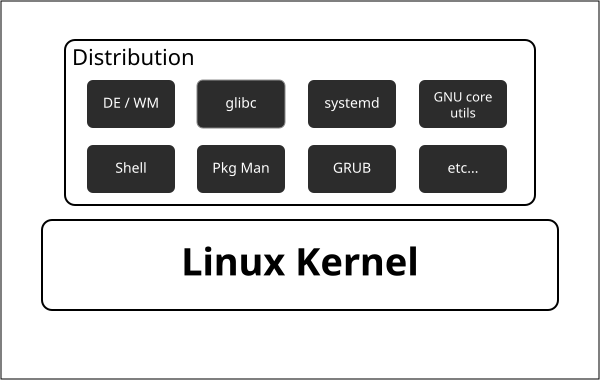

## 誰かが使いやすくしてくれたLinux環境

そもそも、厳密にはLinuxという名称は`Linux Kernel`を指します。Kernelというのはプロセスやメモリ、ファイルシステムなどのリソース管理などを行うプログラムであり、それ単体で使うにはいささか不便です。そこでLinuxを普段使いするために便利なライブラリなどのソフトウェア、ディストリビューションをインストールするためのインストーラーなどの諸々のスタートキット的なツールを同梱して配布されているのが、Linux ディストリビューションと呼ばれるものです。

画像の通り、様々なパッケージや管理システムをまるめて再配布しているのがディストリビューションなのですが、その同梱されるものについてもある程度解説します。

### DE/WMとは

デスクトップ環境を管理するソフトウェア郡。詳しくは[こちら](DE_WM)

### glibcとは

[GNU](https://www.gnu.org/) による標準のCライブラリ実装の1つ。多くのソフトウェアが共用するのでシステム側でインストールして、それらに動的リンクすることが多い。

### systemdとは

Linux上で動作するサービス(バックグランドで動作するようなソフトウェア)の管理を行うツール。具体的にはネットワークの管理ツールや、システムログ、.ディスク管理などのさまざまなサービスを扱います。またそれらの自動機能やログ管理などをsystemd、1つで行います。

主に`systemctl`というコマンドにより操作します。より具体的な話は->

余談ですが、`systemd`はログをバイナリで保存します。これにより効率的なインデックスなどを行えるのですが、それをテキストとして書き出そうとすると`journalctl`コマンドを使う必要があります。またsystemdという単一のソフトウェアに複数の機能をもたせすぎ、などの点でUnix的でないと批判されることもあります。ではほとんどsytemdを採用しています。(あくまで私見ですがLinuxは思想より実用性重視な哲学を持っていると思います)

### GNU Core Utilitiesとは

Linux系のシステムで使用する基本的なコマンドのグループ。ほとんどのディストリビューションにはデフォルトででインストールされている。具体的には`cd`,`ls`など。[一覧](https://wiki.archlinux.jp/index.php/Core_utilities)

### Shellとは

-> Shellとは

### Package Manager(Pkg Man)とは

システムやユーザーのパッケージを管理するツール。`apt`とか`dnf`とか。詳しくは->

### GRUBとは

Linuxをブートするためのツール(boot loader)の一つ。Linuxが起動する前にLinuxをbootするためのソフトウェア。GRUBはメジャーで多くのディストリビューションで採用されている。選ぼうと思えば選べる。

[boot loader](https://wiki.archlinux.jp/index.php/Arch_%E3%83%96%E3%83%BC%E3%83%88%E3%83%97%E3%83%AD%E3%82%BB%E3%82%B9#%E3%83%96%E3%83%BC%E3%83%88%E3%83%AD%E3%83%BC%E3%83%80%E3%83%BC)
[GRUB](https://wiki.archlinux.jp/index.php/GRUB)

## 具体的なディストリビューション

ディストリビューションは[distrowatch.com](https://distrowatch.com/)や[ZDNET-Linux](https://japan.zdnet.com/search/?ie=UTF-8&q=linux&sa=1&siteurl=japan.zdnet.com%2F&ss=)などを見てみればわかる通り、無限に存在するとも言える程度には大量に存在します。

しかしディストリビューションも無秩序に増えているわけではなく、全てがオリジナルというわけではありません。多くのディストリビューションは何らかのディストリビューションをベースにして、同時のカスタムやソフトウェアを内包して再配布されています。

この再配布という構造がLinuxの流行った要因の1つであり、一般的なソフトウェアの配布はライセンスなどの問題で出来ない事が多いです。(Microsoftなどの[プロプライエタリ](https://ja.wikipedia.org/wiki/%E3%83%97%E3%83%AD%E3%83%97%E3%83%A9%E3%82%A4%E3%82%A8%E3%82%BF%E3%83%AA%E3%82%BD%E3%83%95%E3%83%88%E3%82%A6%E3%82%A7%E3%82%A2)なソフトウェアにおいては多くの場合ライセンス違反になる)
しかし、Linuxやその周辺ではOSS(特にGPL系)ライセンスとしてソフトウェアが公開されることが多く、細かい条件は各種ライセンスによりますが、再配布が容易であることがほとんどです。

OSSについては[こちら]()

話を戻して、具体的なディストリビューションとして多くがベースとなるディストリビューションを持つと記述しましたが、代表例として以下の3つを3大ディストリビューションと呼びます。大体のディストリビューションはこれらのディストリビューションをベースとされています。[List of Linux distributions(wikipedia)](https://en.wikipedia.org/wiki/List_of_Linux_distributions)の画像を見ればわかりますが多くの(特にDebian based)ディストリビューションが何らかのディストリビューションをベースに生まれていることがわかります。

- Debian/Ubuntu[^1]
- RedHat
- Slackware

また、人によってはArchを入れて4大ディストリビューションと呼ぶ人もいるよう...?

## ディストリビューションの探し方

[Distrowatch](https://distrowatch.com)という紹介サイトや[ZDNETのlinuxページ](https://japan.zdnet.com/software/sp_22linux_know_how/)、XやRedditなどのSNSを見てみてるのが新しい情報などは手に入りやすいでしょう。また、適切な回答が返ってくるかは怪しいですが、サークルのメンバーやサーバーで聞いてみてみるのも1つの手です。

[Distrowatchの検索](https://distrowatch.com/search.php)で以下のように`Based on`にベースとなったディストリビューションを指定して検索できます。

[^1]: UbuntuがDebianベースで多くのディストリビューションはUbuntuをベースとしているため、実質的にはDebianベースとも言えます。ただ直接的な親はubuntuだよなぁというレンマを表現した結果のDebian/ubuntu表記です。
